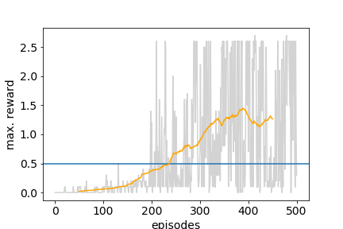

# Report of Deep reinforcement learning: Solving the UnityEnvironment Tennis

### Introduction
The repository contains the third and final project of the Udacity Deep Reinforcement Learning Nanodegree.

For this project, the [Tennis](https://github.com/Unity-Technologies/ml-agents/blob/master/docs/Learning-Environment-Examples.md#tennis) environment is used.

It is solved by the DDPG algorithm enhanced by bootstrap and priorized replay methods. This way the environment is solved in less than 200 episodes. Note, that the algorithm is optimized to solve the environment in the collaboration scenario.
The algorithm shall be explained in the following.

### Environment
In this environment, two agents control rackets to bounce a ball over a net. If an agent hits the ball over the net, it receives a reward of +0.1.  If an agent lets a ball hit the ground or hits the ball out of bounds, it receives a reward of -0.01.  Thus, the goal of each agent is to keep the ball in play.

The observation space consists of 8 variables corresponding to the position and velocity of the ball and racket. Each agent receives its own, local observation.  Two continuous actions are available, corresponding to movement toward (or away from) the net, and jumping. 

The task is episodic, and in order to solve the environment, your agents must get an average score of +0.5 (over 100 consecutive episodes, after taking the maximum over both agents). Specifically,

- After each episode, we add up the rewards that each agent received (without discounting), to get a score for each agent. This yields 2 (potentially different) scores. We then take the maximum of these 2 scores.
- This yields a single **score** for each episode.

The environment is considered solved, when the average (over 100 episodes) of those **scores** is at least +0.5.

### DDPG Algorithm

The Tennis environment has a continuous action space. One reinforcement algorithm being capable to output continious actions is DDPG - Deep Deterministic Policy Gradient. The DDPG algorithm (defined in **ddpg_agent.py**) uses an actor and a critic function, which are represented by neuronal networks defined in **model.py**.
Using this, the learning recursing flow is as follows (see **Tennis.ipynb**):

1. Define action based on last state using the actor and add some noise on it
2. Run the environment to obtain next state, reward and done (epsiode closed or not)
3. Add [action, state, next_state, reward, done] tuple to the memory (**priorized_memory.py**)
4. Teach the critic function (after every "Learning_Rate" step) 

In the tennis environment there are to players.
In this implementation each agent is modelled seperately with a DDPG agent object.
Hence, each agent only considers its own state and action space. This is sufficient knowledge for the collaboration scenario. To train a competing agent it is benificial to know the opponent's strategy. 
Hence, this implementation is optimized to solve the environment by cooperation. 

Still, training the agent with standard DDPG agents does not quite work well. The reason is that (even for humans) it is quite difficult to hit the ball correctly. Hence, very few positive cases emerge and there is nothing the agent can learn from. 
Bootstrapping as well as priorized replay are methods which optimize the usage of positive experiences which is be explained in the following.

### Bootstrapping and priorized replay
  
The two methods are mostly defined in **priorized_replay.py**. Priorized replay assigns to each experience a priorization factor p. Next, to sample the mini batch for training a function of p 
parametrized by some hyperparameters gives the probability distribution for sampling experiences:\
f(p, prio_exponent, prio_epsilon) = (p+prio_epsilon)^(prio_exponent) / sum_p ((p+prio_epsilon)^(prio_exponent))\
For bootstrapping, the rewards are recalculated by aggregating the rewards of the following "N_Bootstrap" experience sequences. 
This ensures that actions, which lead to a certain (positive) reward, are immediately rewarded.\
Please note that in order to combine these two methods, the order of the experiences in the memory needs to be conserved.

### Parameters
As in every reinforcement algorithm the results are very sensible on the parameters. Particularly the noise parameters need to be adapted with care. 
The given setup is surely not yet the optimal one, there is much room for exploration
Please extract all parameters from the Tennis.ipynb. Here, we just report the most important ones: 

n_episodes = 500 - Number of episodes\
Batch_size = 128 - Batch size for learning\
N_Bootstrap = 4 - Depth of bootstrapping\
prio_exponent = 0.8 - Exponent for priorized replay -> the closer to 1, the more priorization\
LR_actor = 1e-3 - learning rate of the actor\
LR_critic = 1e-3 - learning rate of the critic\
theta = .03  - relaxation rate OU process\
sigma = .04  - standard deviation of Gaussian noise in OU process

### Results

As can be seen in the notebook, the algorithm solves the environment in about 200 episodes, which is faster than with standard DDPG methods. Also, it leads to a high average score > 1.
On the other hand, the results are not stable. If sufficient positive experience is not made by chance at the beginning, convergence is not guaranteed.
Here is the result plot for the given parameters with seed = 0:

### Future Work

As described above, the environment is solved for the collaborative scenario. It would be interesting to solve it as well for the competetive scenario. To this end, not much change is needed:
- The rewards have to be adapted such that each agent obtains positive feedback when the other fails.
- Information of the opposing agent's state, actions and strategies is useful to optimize the agent's strategy.
One possible solution could be MADDPG (Multi-Agent DDPG). In this case, one single agent conditions its policies on the policies,actions and states of each agent. 

